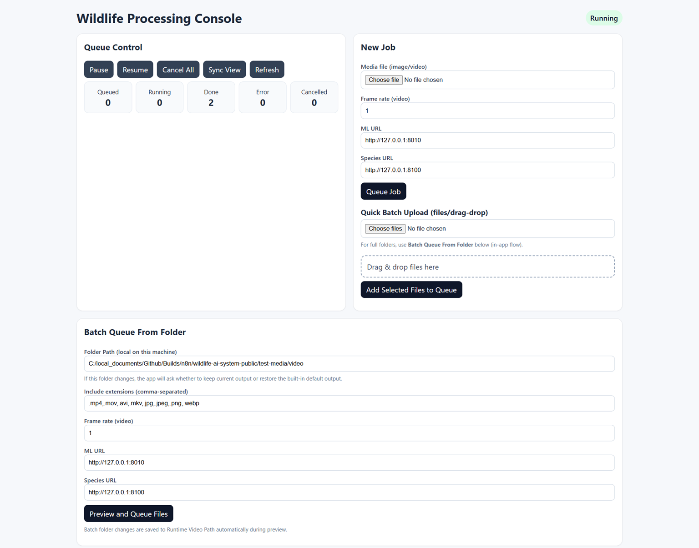
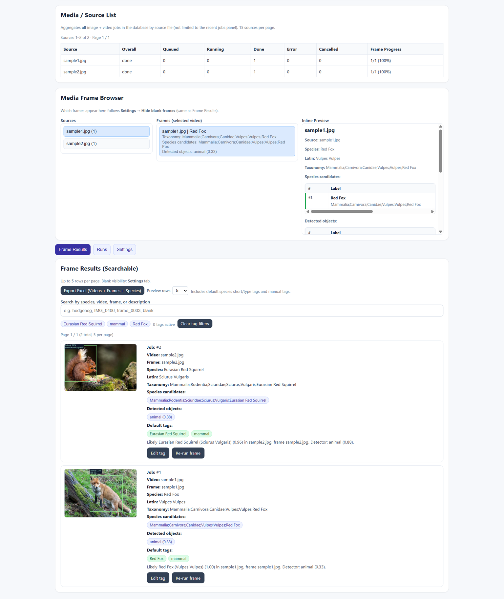
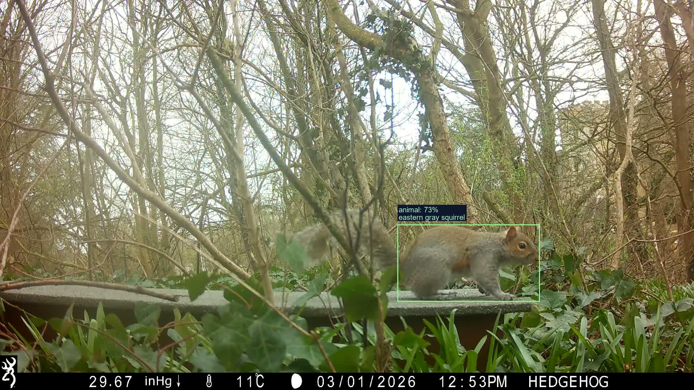

# Wildlife AI System (Public Deploy)

Run a wildlife-processing stack using **prebuilt Docker images**:
- MegaDetector-style object detection
- Optional species classification
- Batch UI
- Local Python web app for uploads, queues, and annotated previews

This repository is deployment-focused. It includes Docker Compose files, environment templates, scripts, and the local web app.
Container images are pulled from **GHCR** (GitHub Container Registry). Core service source code is maintained in a separate upstream repository.


---

## 5-minute setup

### Fastest path (Windows quick demo)

```powershell
# 1) Start containers from published images
.\scripts\quick-demo.ps1

# 2) In a new terminal, start the local web app
.\scripts\run-webapp.ps1
```

Then open: `http://127.0.0.1:8110`

### Standard path (custom .env)

```powershell
# 1) Create local env file
Copy-Item .env.example .env

# 2) Start container stack
docker compose --env-file .env up -d

# 3) Start web app (new terminal)
.\scripts\run-webapp.ps1
```

Optional species service:

```powershell
docker compose --env-file .env --profile species up -d
```

---

## First-time setup (new clone)

Do these steps **once** after you clone the repository.

| Step | What to do |
|------|------------|
| **1** | **Create your local env file.** The repo ships **`.env.example`** (template only). Copy it to **`.env`** and edit values there. |
| **2** | **Never commit `.env`.** It is [gitignored](.gitignore) so secrets and machine-specific paths stay off GitHub. Only **`.env.example`** is committed so others know which variables exist. |
| **3** | **Set image tags** in `.env`: use `:local` only if you built images yourself; otherwise set tags that exist in GHCR for your org (see [Container images](#container-images-ghcr)). |
| **4** | Start Docker Compose (see [Quick start](#quick-start-docker)) or on Windows run **`.\scripts\run.ps1`** (creates `.env` from `.env.example` if missing). Add **`-Species`** to that script to include the species service. |

**Copy commands**

```powershell
# Windows (PowerShell), from repo root
Copy-Item .env.example .env
notepad .env   # or your editor
```

```bash
# macOS / Linux, from repo root
cp .env.example .env
${EDITOR:-nano} .env
```

Some scripts (for example **`scripts\test-local.ps1`**) copy **`.env.example` → `.env`** automatically if `.env` is missing—still review `.env` before relying on it in production.

### Quick demo (pull published images, no local builds)

On **Windows (PowerShell)** from the repo root:

1. **`.\scripts\quick-demo.ps1`** — copies **`.env.demo`** → **`.env`** if `.env` is missing, pulls **`ghcr.io/enablsoft/...:latest`**, starts the stack, and waits for `/health`. Use **`-Species`** to include the species service; use **`-OverwriteEnv`** to replace an existing `.env`.
2. In another terminal: **`.\scripts\run-webapp.ps1`**, then open **http://127.0.0.1:8110**.

**`.env.demo`** is committed (no secrets) and pins public **`:latest`** tags for a smoke test. For production, copy **`.env.example`** and set explicit image tags.

---

## Contents

| Area | What you use it for |
|------|---------------------|
| **`.env.example`** | Committed template—copy to `.env` and customize |
| **`.env.demo`** | Optional: published `:latest` image tags for `quick-demo.ps1` |
| **`docker-compose.yml`** | ML service, batch UI, optional species profile |
| **`scripts/`** | PowerShell: stack health, tests, web app, `run.ps1` helper |
| **`webapp/`** | FastAPI UI: queue, runs, frame browser, batch folder enqueue |
| **`test-media/`** | Local input/output/video workspace (outputs are gitignored) |
| **`config/`** | Optional `stack.json` overrides (see `stack.example.json`) |
| **`docs/`** | Architecture, package roles, and upstream reference mapping |

---

## Container images (GHCR)

| Image | Role |
|-------|------|
| `ghcr.io/enablsoft/wildlife-ai-ml-service` | Detector / ML API |
| `ghcr.io/enablsoft/wildlife-ai-batch-ui` | Batch UI |
| `ghcr.io/enablsoft/wildlife-ai-species-service` | Optional species classification |

Set full image names and tags in **`.env`** (see **`.env.example`**). If images are **private** on GHCR, run `docker login ghcr.io` before `docker compose pull`.

---

## Package roles

The public deploy stack centers around three published container images:

- **`wildlife-ai-ml-service`**: Core detector API. Runs the MegaDetector/YOLO-family inference pipeline and returns structured detections (bounding boxes, classes, confidence).
- **`wildlife-ai-batch-ui`**: Batch workflow UI and orchestration surface. Provides queue/run management and result browsing; it does not host model weights itself.
- **`wildlife-ai-species-service`** (optional): Species classification API used to enrich detections with species labels and scores when the `species` profile is enabled.

How they work together:

1. `ml-service` performs object detection.
2. `species-service` (optional) adds species-level predictions.
3. `batch-ui` coordinates workflows and presents results to operators.

The exact detector/species model versions are determined by image tags in `.env` (`ML_SERVICE_IMAGE`, `SPECIES_SERVICE_IMAGE`).

Example flow:

- Upload a camera-trap image from the local web app.
- `ml-service` returns detections such as `animal` with bounding boxes and confidence scores.
- If the species profile is enabled, `species-service` adds species labels/scores for detected crops.
- The UI stores and renders the combined results for review and export.

---

## Models used

- **Detector model (ml-service):** MegaDetector/YOLO family model for object detection in camera-trap images (animal/person/vehicle style detections with bounding boxes + confidence).
- **Species model (species-service, optional):** Species classification model that predicts species labels and scores for frames/images.

The exact model version can vary by image tag (`ML_SERVICE_IMAGE`, `SPECIES_SERVICE_IMAGE` in `.env`).

---

## Prerequisites

- **Docker** and **Docker Compose** v2  
- **Windows**: PowerShell for the scripts below  
- **Optional**: [ffmpeg](https://ffmpeg.org/) on the host for video workflows (scripts may offer `winget` install on Windows)  
- **Python 3.10+** and a venv if you run the local web app (see [Local web app](#local-web-app))

---

## Quick start (Docker)

1. Ensure **`.env`** exists (copy from **`.env.example`** if needed—see [First-time setup](#first-time-setup-new-clone)).

2. **Start the core stack**

   ```powershell
   docker compose --env-file .env up -d
   ```

   On Windows you can instead run **`.\scripts\run.ps1`** (add **`-Species`** to start the species profile too).

3. **Optional — include species service**

   ```powershell
   docker compose --env-file .env --profile species up -d
   ```

4. **Health checks** (defaults match **`.env.example`**)

   | Service | URL |
   |---------|-----|
   | Detector (ML) | http://localhost:8010/health |
   | Batch UI | http://localhost:8090/health |
   | Species (if enabled) | http://localhost:8100/health |

5. **Stop**

   ```powershell
   docker compose --env-file .env down
   ```

### Setup and cleanup helpers

Use helper scripts for common Docker lifecycle actions:

```powershell
# Setup/start (optionally pull first)
.\scripts\stack-setup.ps1 -Pull
.\scripts\stack-setup.ps1 -Pull -Species
.\scripts\stack-setup.ps1 -Pull -Species -Interactive

# Cleanup/stop
.\scripts\stack-cleanup.ps1
.\scripts\stack-cleanup.ps1 -Species
.\scripts\stack-cleanup.ps1 -Species -Interactive

# Deep cleanup (containers + compose images + volumes + dangling images)
.\scripts\stack-cleanup.ps1 -Species -RemoveImages -RemoveVolumes -PruneDangling

# Preview cleanup commands only (no changes)
.\scripts\stack-cleanup.ps1 -Species -RemoveImages -RemoveVolumes -PruneDangling -Preview
```

Note: `stack-cleanup.ps1` is project-scoped for compose resources.  
Only `-PruneDangling` applies globally, and only to dangling images.

---

## Host paths (batch UI)

Volumes are wired in `docker-compose.yml` via **`.env`**:

| Variable | Default | Mounted into `batch-ui` as |
|----------|---------|----------------------------|
| `HOST_DATA_DIR` | `./data` | `/data` |
| `HOST_MEDIA_DIR` | `./media` | `/data/media` |
| `HOST_CONFIG_DIR` | `./config` | `/app/config` (read-only) |

---

## Species service

- Declared as Compose **profile** `species` so the base stack runs without it.
- Enable when you need species endpoints:

  ```powershell
  docker compose --env-file .env --profile species up -d
  ```

- Set `SPECIES_SERVICE_IMAGE` in **`.env`** if you use a custom tag.

---

## Local web app

A **FastAPI** app in `webapp/` provides a browser UI for local processing (uploads, video frame extraction, detector + species calls, annotated outputs, SQLite job history).

**Features (summary)**

- Upload images/videos; extract frames from video  
- Call detector and species services; save JSON and annotated images under `test-media/output/run_<timestamp>/`  
- Job queue, run history, pause/resume, retry/cancel  
- Frame results with search and pagination; **Video / source summary** table  
- **Settings** tab: hide blanks + species label mode (short / latin / full taxonomy)  
- Batch enqueue from a folder path; output browser and **Open folder** (OS) for completed jobs  
- Excel export preview supports 5/10/20 row sample and includes latin + taxonomy columns before download

**Run**

1. Start the stack (include species if you want species labels):

   ```powershell
   docker compose --env-file .env --profile species up -d
   ```

2. Start the web app:

   ```powershell
   .\scripts\run-webapp.ps1
   ```

3. Open **http://127.0.0.1:8110** (localhost-only bind by default).

`run-webapp.ps1` installs Python dependencies into your environment and may attempt **ffmpeg** via `winget` on Windows if missing.
It also auto-stops an existing local `uvicorn webapp.app:app` process on `127.0.0.1:8110` before starting, so reruns do not fail with port-in-use errors.

**Screenshots**





**Webapp log rotation**

- Logs are written to `logs/webapp.log`.
- Rotation is time-based (`TimedRotatingFileHandler`) and configurable via `.env`:
  - `LOG_ROTATE_WHEN` (default `midnight`)
  - `LOG_ROTATE_INTERVAL` (default `1`)
  - `LOG_BACKUP_DAYS` (default `14`)
- Example: hourly rotation with 48 backups:

  ```dotenv
  LOG_ROTATE_WHEN=H
  LOG_ROTATE_INTERVAL=1
  LOG_BACKUP_DAYS=48
  ```

**Database backend (SQLite or MongoDB)**

- Default backend is SQLite (`data/webapp_jobs.sqlite`).
- To use MongoDB for job/control/tag storage, set in `.env`:

  ```dotenv
  DB_BACKEND=mongo
  MONGO_URI=mongodb://127.0.0.1:27017
  MONGO_DB_NAME=wildlife_webapp
  ```

- Optional for tests: `MONGO_URI_TEST` can point smoke tests to a dedicated Mongo instance (otherwise tests use `MONGO_URI`).

- Restart `.\scripts\run-webapp.ps1` after changing backend settings.
- Mongo mode keeps media/output files on disk as before; only metadata storage changes.
- Safety behavior: if `DB_BACKEND=mongo` is set but Mongo is unavailable/unreachable at startup, the app falls back to SQLite and continues to run.

**Batch folder flow**

1. Use **Batch queue from folder** with a local path and file extensions.  
2. **Enqueue folder** and watch progress in **Runs**.  
3. Use **Output browser** / **Open folder** on finished jobs.

**Advanced:** copy `config/stack.example.json` to `config/stack.json` to override container-side paths (see `optional_batch.*` keys).

---

## Terminal tests (`test-media`)

| Script | Purpose |
|--------|---------|
| `.\scripts\test-local.ps1` | Process images in `test-media/input/` → write `*.ml.json` / `*.species.json` under `test-media/output/` |
| `.\scripts\test-video.ps1` | Extract frames from a video in `test-media/video/` into `test-media/input/`, then run `test-local.ps1` |

Supported image types: `.jpg`, `.jpeg`, `.png`, `.webp`. Video: `.mp4`, `.mov`, `.avi`, `.mkv`.

---

## Backups and restore

One-command wrappers (auto-select by `DB_BACKEND`):

```powershell
.\scripts\backup.ps1
.\scripts\restore.ps1 -BackupPath "<path-to-backup>"
```

Wrappers print guard warnings when flags are used with the wrong backend mode.

### SQLite mode (`DB_BACKEND=sqlite`)

Create a timestamped backup zip:

```powershell
.\scripts\backup-all.ps1
```

Includes (when present):

- `data/webapp_jobs.sqlite`
- `logs/`

Optional media data:

```powershell
.\scripts\backup-all.ps1 -IncludeMedia
```

Restore from a backup archive:

```powershell
.\scripts\restore-all.ps1 -ArchivePath ".\backups\wildlife_backup_YYYYMMDD_HHMMSS.zip"
```

Use `-Force` to overwrite existing `data/`, `logs/`, or `test-media/*` targets.

### Mongo mode (`DB_BACKEND=mongo`)

Create a Mongo metadata backup using MongoDB Database Tools:

```powershell
.\scripts\backup-mongo.ps1
```

Create as zip:

```powershell
.\scripts\backup-mongo.ps1 -Zip
```

Restore Mongo metadata:

```powershell
.\scripts\restore-mongo.ps1 -BackupPath ".\backups\mongo_dump_wildlife_webapp_YYYYMMDD_HHMMSS.zip"
```

By default restore uses `--drop` (replace existing collections). Use `-NoDrop` to keep existing documents.

---

## SQLite -> Mongo cutover checklist

Use this when moving existing runtime metadata from SQLite to Mongo.

1. **Back up current SQLite data**

   ```powershell
   .\scripts\backup.ps1 -IncludeMedia
   ```

2. **Run backend preflight checks**

   ```powershell
   # Check current backend from .env
   .\scripts\check-db-backend.ps1

   # Check Mongo target explicitly
   .\scripts\check-db-backend.ps1 -Backend mongo
   ```

3. **Run dry-run migration summary**

   ```powershell
   .\scripts\migrate-sqlite-to-mongo.ps1 -DryRun
   ```

   If `.env` currently has `DB_BACKEND=mongo`, migration is blocked by default to avoid accidental live writes.  
   Use `-AllowWhileMongoActive` only when you intentionally need to bypass this guard.

4. **Run migration**

   ```powershell
   .\scripts\migrate-sqlite-to-mongo.ps1
   ```

   Validate sync:

   ```powershell
   .\scripts\check-sync.ps1
   ```

5. **Switch runtime backend**

   ```dotenv
   DB_BACKEND=mongo
   MONGO_URI=mongodb://127.0.0.1:27017
   MONGO_DB_NAME=wildlife_webapp
   ```

6. **Restart webapp and verify**

   ```powershell
   .\scripts\run-webapp.ps1
   .\scripts\check-db-backend.ps1 -Backend mongo
   ```

### Rollback checklist

1. Set `DB_BACKEND=sqlite` in `.env`.
2. Restart webapp (`.\scripts\run-webapp.ps1`).
3. If needed, restore latest SQLite backup:

   ```powershell
   .\scripts\restore.ps1 -BackupPath ".\backups\wildlife_backup_YYYYMMDD_HHMMSS.zip" -Force
   ```

4. Confirm sqlite checks:

   ```powershell
   .\scripts\check-db-backend.ps1 -Backend sqlite
   ```

---

## Backend smoke tests

Run backend smoke tests with one command:

```powershell
.\scripts\test-backends.ps1
```

Bi-directional migration helper (Mongo -> SQLite):

```powershell
.\scripts\migrate-mongo-to-sqlite.ps1 -DryRun
.\scripts\migrate-mongo-to-sqlite.ps1
```

---

## Environment preflight

Check required `.env` keys before running app/tests:

```powershell
.\scripts\check-env.ps1
```

Include Mongo requirements too:

```powershell
.\scripts\check-env.ps1 -ForMongo
```
